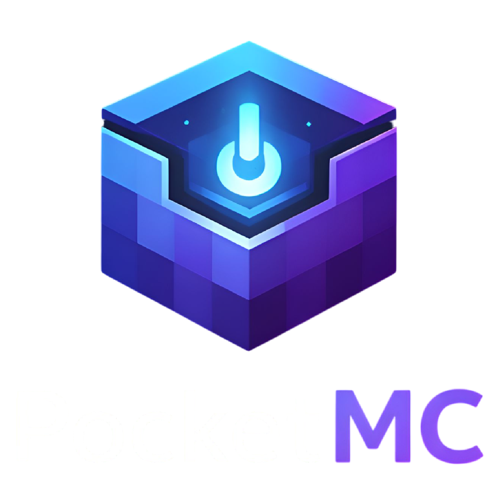
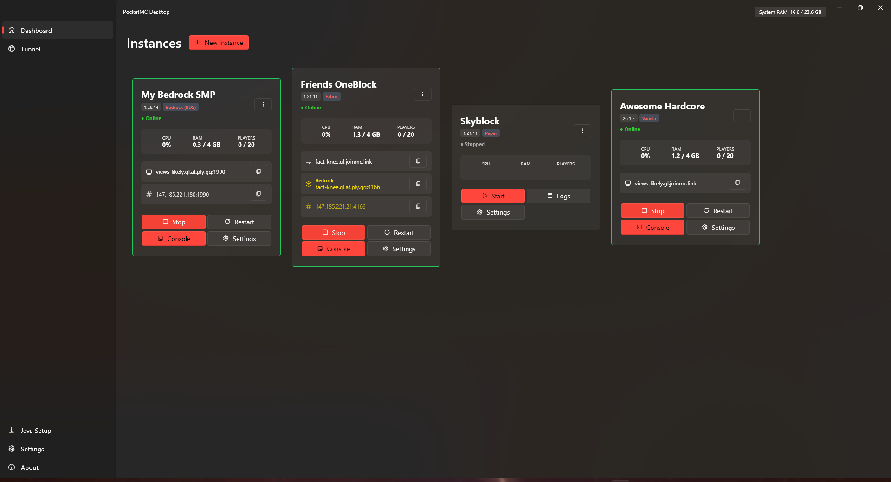
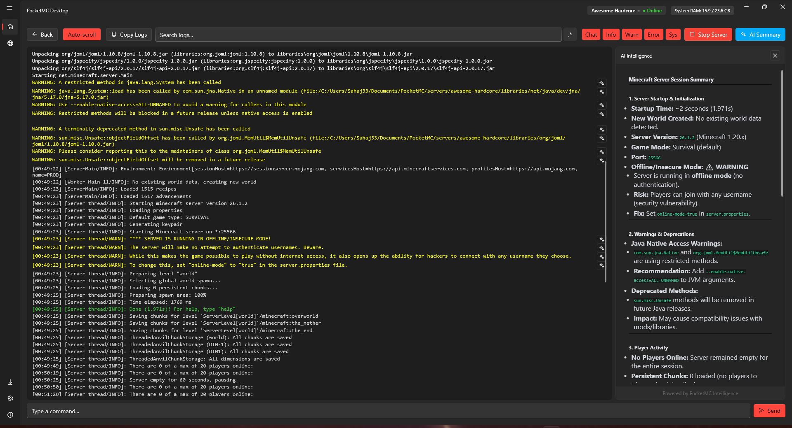
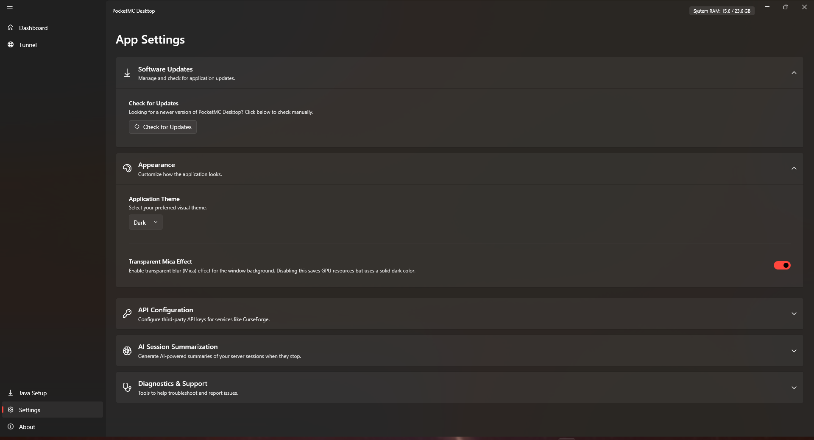
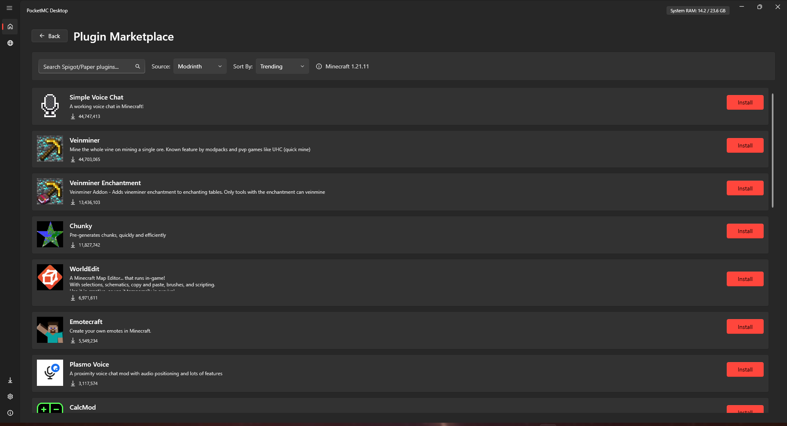

<div align="center">

<!-- Replace with your actual logo -->



**A professional Minecraft Java Edition server manager for Windows.**  
Run, monitor, and share servers from your own machine, no sysadmin skills required.

[](https://github.com/divyviradiya2/pocket-mc-desktop/actions)
[](https://dotnet.microsoft.com/)
[](https://www.microsoft.com/windows)
[](LICENSE)
[](https://github.com/divyviradiya2/pocket-mc-desktop/releases)

---

<!-- Replace with your actual screenshot -->


</div>

---

## What Is This?

PocketMC Desktop is a **Windows-native GUI** for managing one or more Minecraft Java Edition servers on your local machine. It handles the parts that are annoying to do manually, Java runtime setup, process supervision, tunnel routing for public access, backups, plugin management, wrapped in a modern Fluent UI shell.

It is not a hosting panel. It runs on your PC. Your server, your hardware, your control.

---

## Features

### Instance Management
- Create multiple server instances side-by-side, each isolated in its own folder
- Supports **Vanilla** (Mojang) and **Paper** (high-performance) server types
- One-click JAR download directly from Mojang's launcher manifest or PaperMC's API
- Automatic `eula.txt` generation on instance creation
- Per-instance metadata stored in `.pocket-mc.json`, human-readable and portable

### Automatic Java Runtime Provisioning
- Downloads and manages **headless JREs** (Java 11, 17, 21, 25) via the [Adoptium API](https://api.adoptium.net/)
- Isolated from your system's Java install, no version conflicts
- Custom Java executable path override per instance for advanced use cases

### Public Server Tunneling via Playit.gg
- Embedded [Playit.gg](https://playit.gg) agent runs as an app-scoped background process
- First-time claim flow guided through an in-app wizard that opens automatically
- Tunnel address resolved fresh on every server start, never stale-cached
- Graceful handling of the free-tier 4-tunnel limit with a contextual dialog
- Tunnel address displayed on instance cards with **one-click copy to clipboard**
- Agent assigned to a Windows Job Object, guaranteed cleanup if PocketMC crashes

### Server Lifecycle & Process Control
- Start, stop, and restart servers from the dashboard or the dedicated console view
- **Windows Job Object** ensures all Java child processes die with PocketMC, no orphan processes
- Graceful `/stop` command with configurable timeout, hard-kill fallback
- Auto-restart on crash with **exponential backoff** and configurable max attempt limits
- Real-time countdown display while a crashed server waits to restart
- Per-instance session log written to `logs/pocketmc-session.log` with shared-access read

### Resource Monitoring
- Live CPU and RAM metrics per instance via Windows `Process` APIs
- Sparkline history charts per card (powered by LiveCharts 2)
- Global RAM header bar with 90% usage warning
- Player count tracking via log parsing (`joined/left the game`, `/list` command reconciliation)
- Adaptive polling interval, fewer resources consumed when more servers are running

### Server Configuration
- Full `server.properties` editor with categorized UI sections: World, Memory, Players, Network, Gameplay
- Advanced properties data grid for any key not covered by the UI
- Server icon upload with 64×64 dimension validation
- MOTD live preview
- RAM allocation sliders with a system-memory headroom warning
- Per-instance advanced JVM arguments (tokenized correctly, no shell injection)

### World Management
- Upload any world as a **ZIP file**, intelligently hunts for `level.dat` regardless of ZIP structure
- Delete the current world with a single confirmation
- Running-server lock on all world operations

### Plugin & Mod Management
- Browse and install plugins/mods directly from [Modrinth](https://modrinth.com) in-app
- Local `.jar` file import with drag-and-drop support
- Plugin `api-version` parsing from `plugin.yml` inside the JAR, **backward-compatibility-aware** mismatch warnings
- Vanilla plugin tab warns that Paper is required, no silent failure
- Running-server lock on all plugin/mod operations

### Backup System
- Manual and scheduled automatic backups (6h / 12h / 24h intervals)
- Live-server-safe: sends `save-off` → `save-all` → waits for `Saved the game` confirmation before compressing
- Locked-file tolerant: skips `session.lock` and any exclusively held files without failing the whole backup
- Configurable retention, automatically prunes oldest ZIPs beyond the keep limit
- One-click restore (server must be stopped)

---

## Screenshots

| Dashboard | Server Console |
|-----------|---------------|
|  |  |

| Server Settings | Plugin Browser |
|-----------------|----------------|
|  |  |

---

## System Requirements

| Requirement | Minimum |
|---|---|
| OS | Windows 10 1809 (build 17763) or Windows 11 |
| Architecture | x64 |
| RAM | 4 GB (8 GB+ recommended for running servers) |
| .NET Runtime | .NET 8 Desktop Runtime (bundled in installer) |
| Internet | Required for first-run JRE download and Playit.gg tunneling |

> Java does **not** need to be pre-installed. PocketMC manages its own JRE stack.

---

## Installation

### Installer (Recommended)

1. Download `PocketMC_Setup.exe` from the [latest release](https://github.com/divyviradiya2/pocket-mc-desktop/releases/latest).
2. Run the installer. No admin rights required, installs per-user.
3. Launch PocketMC Desktop from the Start Menu or desktop shortcut.
4. On first run, choose a root folder where server instances and runtimes will be stored.

### Build from Source

**Prerequisites:** [.NET 8 SDK](https://dotnet.microsoft.com/download/dotnet/8), [Git](https://git-scm.com/)

```bash
git clone https://github.com/divyviradiya2/pocket-mc-desktop.git
cd pocket-mc-desktop
dotnet build PocketMC.Desktop.sln --configuration Release
dotnet run --project PocketMC.Desktop/PocketMC.Desktop.csproj
```

To build the installer locally, install [Inno Setup 6](https://jrsoftware.org/isinfo.php) and run:

```bash
dotnet publish PocketMC.Desktop\PocketMC.Desktop.csproj -c Release -r win-x64 ^
  -p:PublishSingleFile=true -p:PublishReadyToRun=true --self-contained false -o publish_output

"C:\Program Files (x86)\Inno Setup 6\ISCC.exe" installer.iss
```

The installer will be output to `ReleaseOutput\PocketMC_Setup.exe`.

---

## Getting Started

### 1. First Launch

PocketMC will prompt you to select an **App Root Folder**. This is where everything lives:

```
<AppRoot>/
├── servers/          # One subfolder per server instance
├── runtime/          # Managed JREs (java11, java17, java21, java25)
└── tunnel/           # Playit.gg agent binary and logs
```

On first run, PocketMC downloads the required Java runtimes automatically. This is a one-time setup.

### 2. Create a Server Instance

1. Click **New Instance** on the Dashboard.
2. Enter a name, description, and select server type (Vanilla or Paper).
3. Choose a Minecraft version from the live version list.
4. Accept the [Minecraft EULA](https://aka.ms/MinecraftEULA).
5. Click **Create & Download**, the server JAR downloads automatically.

### 3. Start Your Server

Hit **Start** on the instance card. The server boots, and you'll see live status, CPU, RAM, and player count update in real time.

### 4. Enable Public Access (Optional)

PocketMC integrates with [Playit.gg](https://playit.gg) for free public tunneling:

1. On first start, PocketMC will open a browser and guide you through linking your Playit.gg account.
2. After approval, a tunnel is automatically resolved for your server's port.
3. The public address appears as a **copyable pill** on the instance card.

> Playit.gg free accounts support up to 4 simultaneous tunnels.

---

## Architecture Overview

```
App.xaml.cs  (IHost / DI root)
│
├── MainWindow           → Frame host, global RAM header
│   ├── JavaSetupPage    → JRE acquisition + Playit binary download on first run
│   └── DashboardPage    → Instance grid, Playit health banner, tunnel pill
│       ├── NewInstanceDialog      → JAR download + EULA
│       ├── ServerConsolePage      → Live log viewer, command input
│       └── ServerSettingsPage     → Config, worlds, plugins, mods, backups, crash policy
│
├── Services (Singletons)
│   ├── ApplicationState           → Runtime config store
│   ├── SettingsManager            → Persistent JSON settings
│   ├── InstanceManager            → CRUD for .pocket-mc.json metadata files
│   ├── ServerProcessManager       → Process lifecycle, auto-restart, Job Object
│   ├── ResourceMonitorService     → CPU/RAM polling via Windows Process API
│   ├── BackupService              → Live-safe world zipping with lock-file tolerance
│   ├── BackupSchedulerService     → Interval-based scheduler (60s tick)
│   ├── PlayitAgentService         → playit.exe subprocess management
│   ├── PlayitApiClient            → Tunnel list API, token validation
│   └── TunnelService              → Tunnel resolution orchestration per server start
│
└── Utils
    ├── FileUtils                  → Async copy/delete/clean with read-only stripping
    ├── MemoryHelper               → GlobalMemoryStatusEx P/Invoke, GC fallback
    ├── SlugHelper                 → URL-safe folder name generation with collision handling
    └── SystemMetrics              → Total physical RAM via kernel32
```

**Key architectural decisions:**

- **Windows Job Object** —> all child processes (Java servers, Playit agent) are assigned to a single Job Object. If PocketMC is killed hard (crash, task manager), the OS cleans up every child automatically. No zombie processes.
- **No shell intermediaries** —> `ProcessStartInfo.ArgumentList` is used exclusively. No `cmd.exe`, no argument string concatenation, no injection surface.
- **Tunnel addresses are never cached** —> `PlayitApiClient.GetTunnelsAsync()` is called fresh on every server start. Stale addresses cause connection failures; the API call is cheap.
- **Dispatcher batching in console view** —> a 100ms `DispatcherTimer` flushes a `ConcurrentQueue<LogLine>` in batches of up to 200 lines, preventing UI jank on high-throughput server output.

---

## Tech Stack

| Component | Technology |
|---|---|
| Language | C# 12, .NET 8 |
| UI Framework | WPF + [WPF-UI (Fluent)](https://github.com/lepoco/wpfui) |
| Charts | [LiveChartsCore 2 (SkiaSharp)](https://lvcharts.com/) |
| Toast Notifications | Microsoft.Toolkit.Uwp.Notifications |
| System Tray | Hardcodet.NotifyIcon.Wpf |
| DI / Hosting | Microsoft.Extensions.Hosting |
| Installer | Inno Setup 6 |
| CI | GitHub Actions (Windows-latest) |

---

## Contributing

Contributions are welcome. Before opening a PR:

1. Fork the repo and create a feature branch off `main`.
2. Follow the existing code style, no unnecessary abstractions, self-documenting names.
3. Test process lifecycle edge cases manually (crash recovery, orphan process cleanup).
4. Open a PR with a clear description of what changed and why.

For significant architectural changes, open an issue first to discuss the approach.

---

## Roadmap

- [ ] Bedrock Edition server support
- [ ] In-app whitelist and op management
- [ ] System tray minimization with running-server indicator
- [ ] Multi-monitor window persistence
- [ ] Fabric / Forge server type providers
- [ ] Player activity charts and historical metrics

---

## License

MIT © 2024 PocketMC Contributors — see [LICENSE](LICENSE) for full terms.

---

<div align="center">

Built for people who want to run a Minecraft server,  
not maintain a Linux box.

</div>
