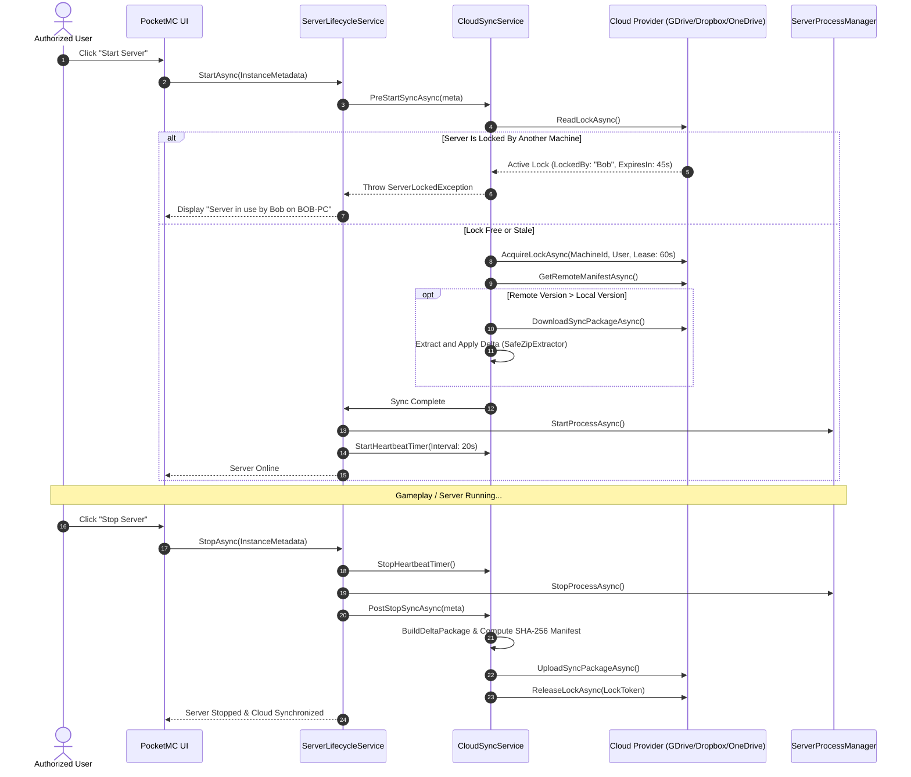

# PocketMC Cloud Storage Synchronization & Shared Server Access

PocketMC supports distributed cloud storage synchronization and shared server access across **Google Drive**, **Dropbox**, and **Microsoft OneDrive**. This feature allows server owners and authorized friends to collaborate on the same Minecraft server without manual file transfers, utilizing distributed server locking to prevent split-brain collisions.

---

## Key Features

- **Distributed Concurrency Lock (Cloud Mutex):** Maintains a remote lease descriptor (`pocketmc-lock.json`) in the instance's cloud folder with a 60-second lease timeout and an automatic 20-second background heartbeat while the server process runs.
- **Collision Protection:** If another player attempts to start the server while it is active on another machine, PocketMC blocks the launch and displays the active user and machine name.
- **Stale Lock Auto-Break & Force Unlock:** If a host machine crashes or loses internet connectivity, the lease automatically expires after 60 seconds. Server owners can also use the **Force Unlock** button with confirmation.
- **Pre-Start Auto-Pull:** Automatically queries the remote sync manifest (`sync-manifest.json`) before binding ports or launching Java/Bedrock. If a newer remote version exists, PocketMC safely pulls and extracts the latest files.
- **Post-Stop Auto-Push:** Upon server shutdown, changed files are automatically compressed into a sync package, uploaded to cloud storage, and the remote lock is released.
- **Selective Folder Sync:** Synchronizes `world`, `server.properties`, `config`, `mods`, and `plugins`. Transient files such as `logs/`, `crash-reports/`, `.hprof` heap dumps, sockets, and runtime binaries are strictly excluded to optimize bandwidth and prevent platform incompatibilities.
- **Conflict Detection:** Verifies SHA-256 hashes of modified files against incoming manifests and preserves `.conflict` backups if collisions occur.

---

## Architectural Workflow

---

## Configuration & Usage

### 1. Connecting Cloud Accounts
Navigate to **Settings -> Cloud Backups** to authenticate your Google Drive, Dropbox, or OneDrive account. Tokens are securely encrypted using Windows DPAPI.

### 2. Enabling Cloud Sync for a Server Instance
Navigate to a server's **Settings -> Backups** tab:
1. Scroll down to the **Cloud Storage Sync & Shared Server** section.
2. Toggle **Enable Cloud Sync**.
3. Choose your preferred cloud provider from the dropdown.
4. Toggle your desired sync options:
   - **Auto-sync on Start**: Pull latest cloud updates before starting the server.
   - **Auto-sync on Stop**: Push changes to the cloud after stopping the server.
   - **Selective Folders**: World, Configs, Mods, Plugins.

### 3. Monitoring & Unlocking
- The **Lock Status** display live-checks whether the server is free or currently locked by another device.
- Use **Sync Now** to trigger an on-demand synchronization at any time.
- If a prior session crashed and left an orphaned lock, click **Force Unlock** to immediately release the remote mutex.
